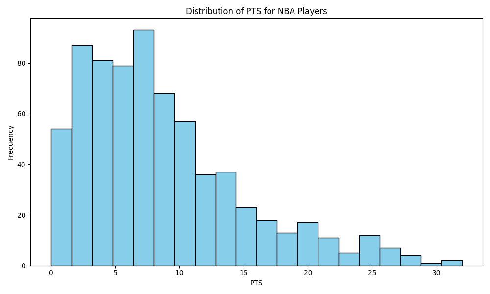
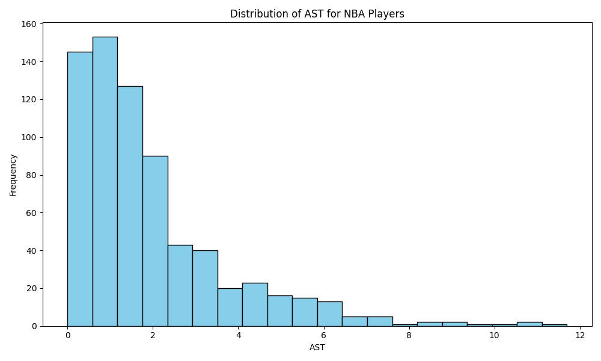
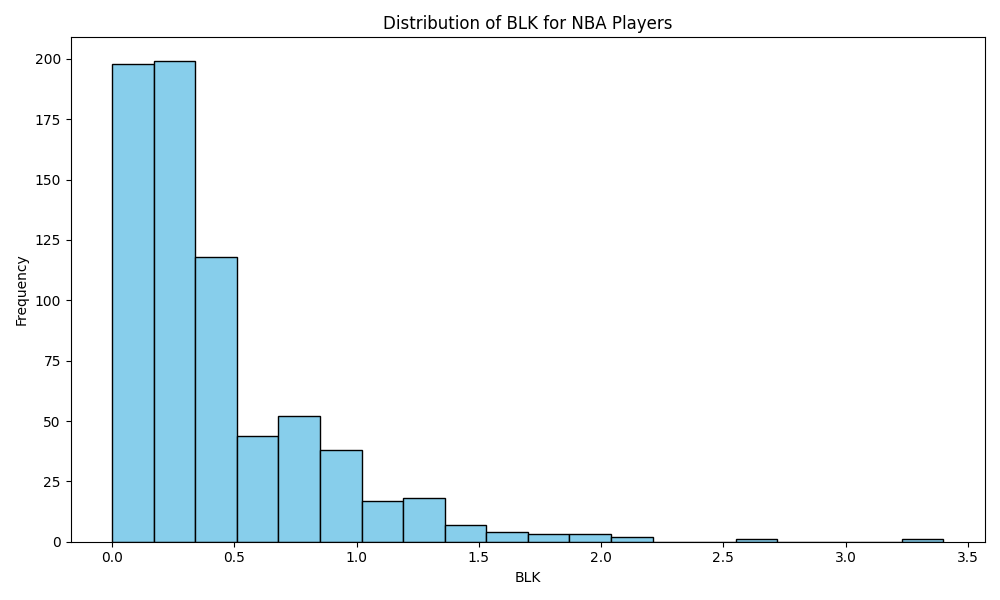

# IDS706_pandas_description_hw2

## Requirements
* Python script using Polars for descriptive statistics
* Read a dataset (CSV or Excel)
* Generate summary statistics (mean, median, standard deviation)
* Create at least one data visualization

## Brief Introduction

### Dataset

#### [`NBA_2021.csv`](NBA_2021.csv)
This is the NBA 2021 global statistics table, which includes data for every player, such as PT (points), BL (blocks), and AT (assists).

### Python Scripts

In [`src/main.py`](src/main.py), This main.py script is used to read data from a CSV file, perform statistical analysis, and generate a data report. The script will generate three images and a PDF report. The three images are histograms showing the distribution of points, assists, and blocks for all players. Additionally, a PDF file with the report will be generated [here](NBA_2021_Report.pdf).

#### points histogram

#### assists histogram

#### blocks histogram

### Extra Credit

All the images and report.pdf in this repo are not initially  submitted by me, but by CI/CD. In [CICD workflow](.github/workflows/CICD.yml), it will setup environment, check the format, run the test, run main.py, commit the output by github bot and push it to this repo.
